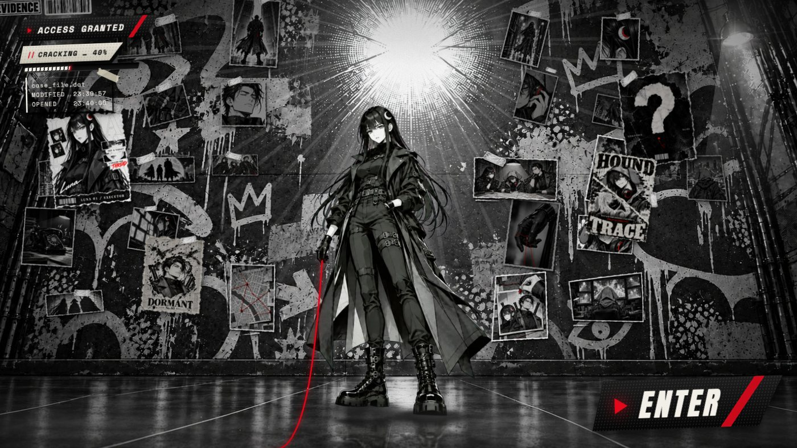
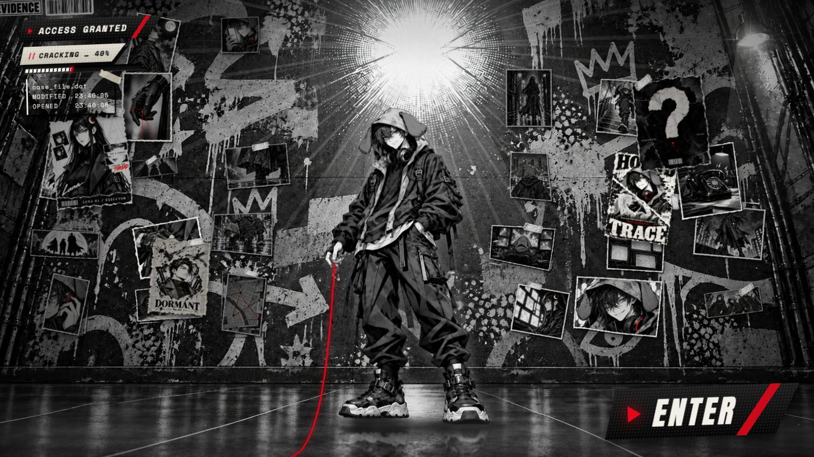
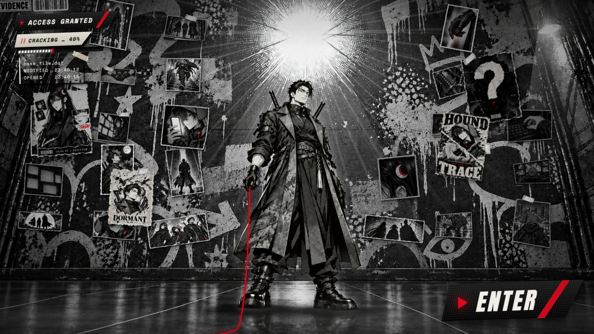
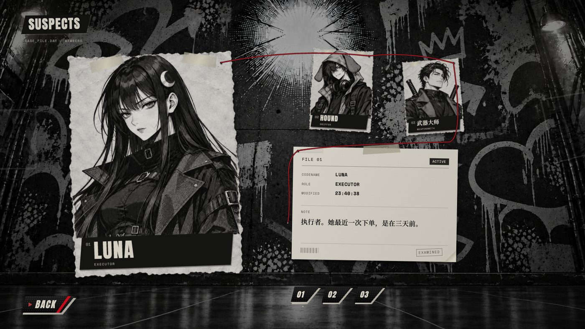
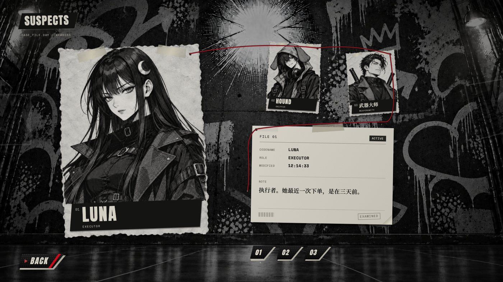
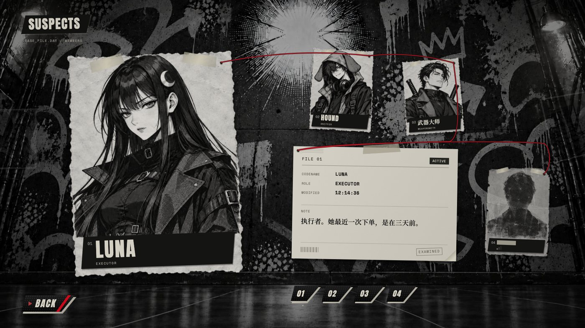
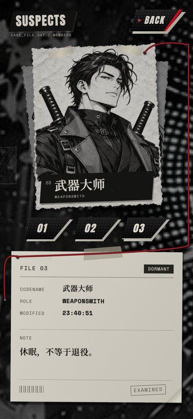

# ████

> 标题故意留白。代号 `black-box`。

一个**游戏化叙事的前端实验**：一个纯静态、不需要构建的网页。访客扮演一名侦探，骇入一个神秘组织的内部系统，顺着已知成员留下的线索往下查。线索一层层收拢，指向同一个没有名字的人，而访客一路上看到的一切，都是那个人早就准备好的。

它跟任何真实系统都没有连接。最初的构思是给一个已经停用的 AI 交易项目做前端，后来只保留了"故事"和"视觉"两件事。

**在线体验：** <https://shangshang21.github.io/black-box/v2/>（桌面浏览器效果最好；手机竖屏也做了适配）

| | |
|:--:|:--:|
|  |  |
|  |  |

---

## 现在有什么（第二轮，`v2/`）

**首页：** 一面涂鸦墙，三位成员里**随机站出一位**（每次打开不同，不会连续重复），像登场动画里的"神秘 boss"。墙上贴着二十多张小分镜和四张撕纸海报，每次打开从 30 张分镜里抽不同的，位置也会微微抖动。人物手里握着一根红线，垂到地上、拖向屏幕外；鼠标移到 `ENTER` 上，他们"放线"，红线绷到按键上；点下去，**画面沿着这根红线被撕开**，露出下一页。

**嫌疑人列队：** 同一面墙，镜头走近。一张大海报是当前选中的成员，另外两位是小海报，旁边是一张贴着胶带的档案卡（编号、状态、代号、角色、最后修改时间、一条中文笔记）。三位成员都看完之后，右下角才会出现**第四个人**：一张只剩轮廓的海报，名字被涂黑，信号很弱。

| | | |
|:--:|:--:|:--:|
|  |  |  |

### 藏起来的东西（"蜜罐"）

整个站点本身就是一个蜜罐：访客以为自己在骇入，其实这个系统是为他搭的。伏笔藏在细节里，第一遍看像小 bug，看完再回想全是线索：

- `ACCESS GRANTED` 在破解进度条走完之前就亮了：门本来就开着。
- 每份档案的"最后修改时间"，永远是你打开它之前 3 秒。点一下这个时间，会多出一行 `OPENED`，两者刚好差 3 秒。
- 第二次来访，页面会先对你说一句「你又来了。」（只用浏览器本地存储，不上传任何东西）。
- 每份档案翻起右下角，纸背都有同一对订书钉的痕迹。
- 档案卡翻角、红线尾巴上那枚小图钉，都可以点。
- 在首页按 `P`，墙面会静悄悄地换成另一幅涂鸦（没有任何提示，找到的人才知道）。

### 操作

| | |
|---|---|
| 首页 | 鼠标移动：视差；移到 `ENTER`：红线绷紧；点击：撕开进入 |
| 列队页 | 点小海报或底部 `01 / 02 / 03` 切换成员；方向键也可以；`BACK` 回首页；手机上左右滑动切换 |
| 开发用网址参数 | `?c=luna\|hound\|smith` 指定首页角色；`?plate=e..l` 指定墙面；`?btn=a\|b\|c` 换 ENTER 按键样式 |

---

## 运行

纯静态，不需要构建，不依赖任何外部网络（动画库和字体都已放进仓库）。

```bash
python3 serve.py        # 带 no-cache 头的静态服务器，默认端口 3200
```

然后打开 <http://localhost:3200/v2/>。第一轮的三个概念切片还在根目录（`index.html`、`b-noir.html` 等），见 [`docs/NOTES.md`](docs/NOTES.md)。

---

## 怎么做的

| 想看 | 去哪 |
|---|---|
| 整个项目是怎么一轮一轮做出来的：设计决定、被推翻的方案、AI 分工和交叉评审的流程 | [`docs/PROCESS.md`](docs/PROCESS.md) |
| 技术细节：图层结构、红线的物理、撕开转场、抠图流水线、性能排查（从 23 帧到 60 帧） | [`docs/TECHNICAL.md`](docs/TECHNICAL.md) |
| 故事设定、设计原则、第一轮的反馈和灵感 | [`docs/NOTES.md`](docs/NOTES.md) |

一句话版本：

- **美术**由图像模型（GPT）生成，再用代码"贴"到页面上：背景墙、人物、分镜、海报都是图；字体排版、UI、动效、物理全是代码。
- **美术指导和集成**由 Claude 负责；**第二页（列队页）的施工**交给 GPT 的编码模型，两边先互相提意见再动手。
- **抠图**用"品红底 + 色键"：让模型把东西画在纯品红 `#FF00FF` 上，再用 [`tools/chroma-key.py`](tools/chroma-key.py) 抠成透明，头发丝之间的缝隙也能抠干净。
- **性能**用 Chrome 调试协议实测（[`tools/perf.mjs`](tools/perf.mjs)），按 Retina 分辨率逐项关掉怀疑对象，而不是凭感觉。

## 目录

```
v2/                 第二轮：首页 + 嫌疑人列队（当前版本）
  index.html        首页的结构和样式、ENTER 的撕开转场
  scene.js          首页场景：分层、红线（Verlet 绳子）、分镜墙、视差、微动
  hub.js hub.css    嫌疑人列队
  sfx.js            用 WebAudio 合成的轻微音效（没有音频文件）
  fonts/ fonts.css  自托管字体（拉丁字母 + 中文子集）
  vendor/           GSAP（动画库）
  assets/           墙面、人物、海报、分镜、胶带贴纸
tools/              抠图、拆图、字体子集、截图、帧率测量等脚本
docs/               文档和截图
serve.py            开发服务器
a-*.html b-*.html c-*.html index.html shared/   第一轮的三个概念切片
```

## 已知的不足

- 列队页的墙比首页更灰、更雾（压暗那一层偏重）。
- 窄屏上中文笔记偶尔会留下一个字单独成行。
- 列队页里的红线是画出来的路径，不像首页那样有物理。
- 点 `ENTER` 撕开的那一刻，偶尔会有一帧 50–150 毫秒的停顿。
- 第四个人被点开之后的"结局"（黑屋子、主控台）还没有做。

## 致谢与许可

- 动画库：[GSAP](https://gsap.com/) 3.15（GreenSock "no charge" 许可）。
- 字体：Anton、Space Mono、Noto Serif SC，均为 SIL Open Font License。
- 图片素材由图像模型生成。视觉上受《女神异闻录5》的 UI 语言、《Framed》的分镜叙事启发，没有使用任何它们的素材。
