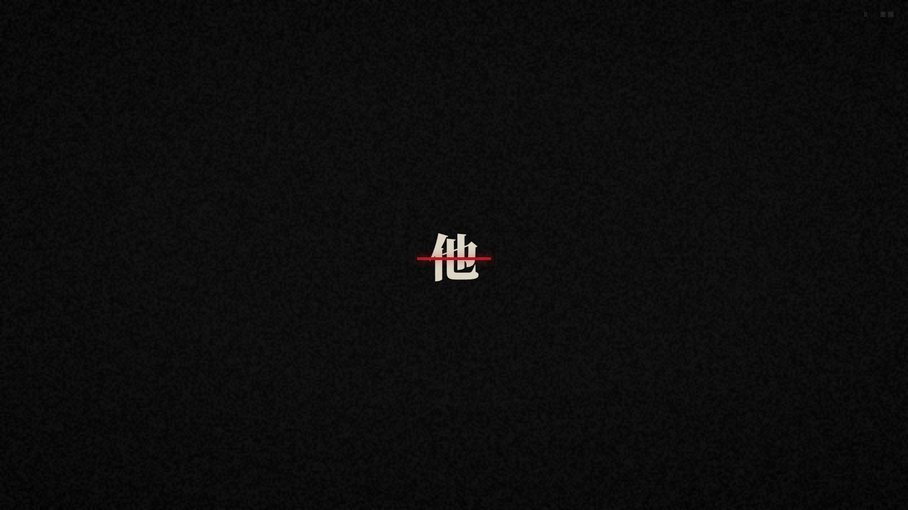
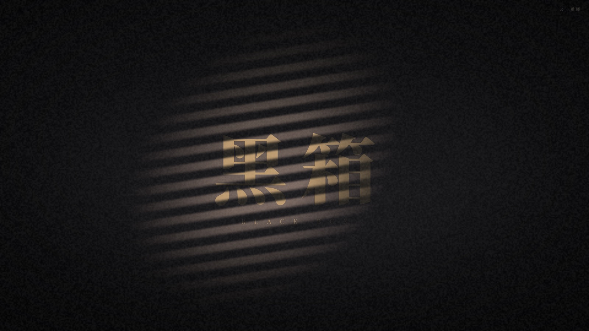
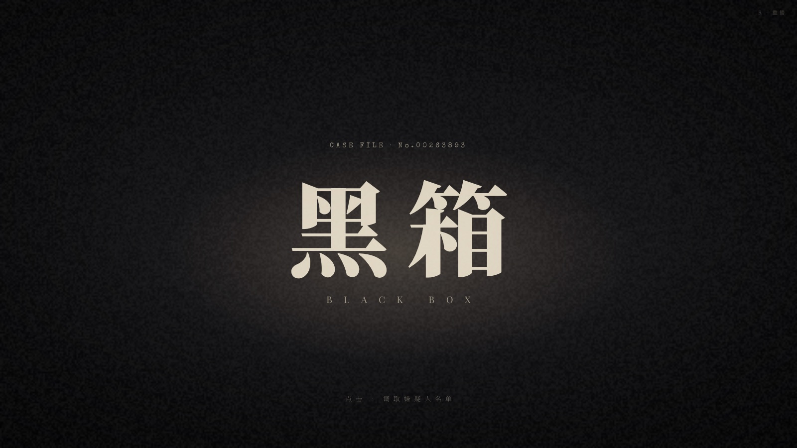
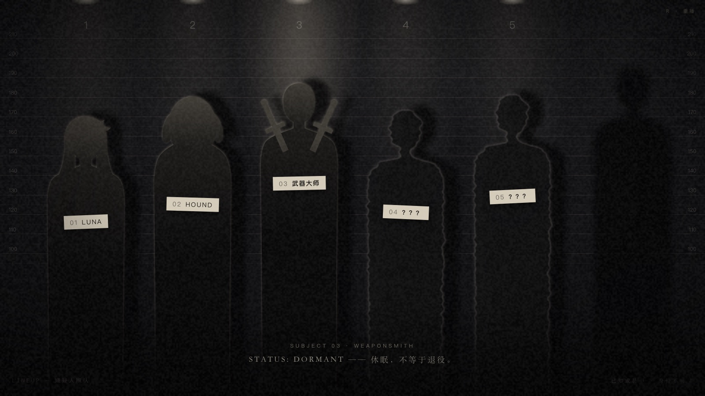
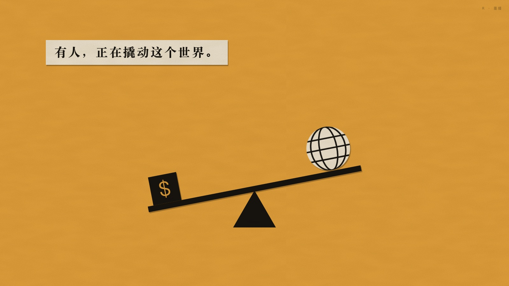
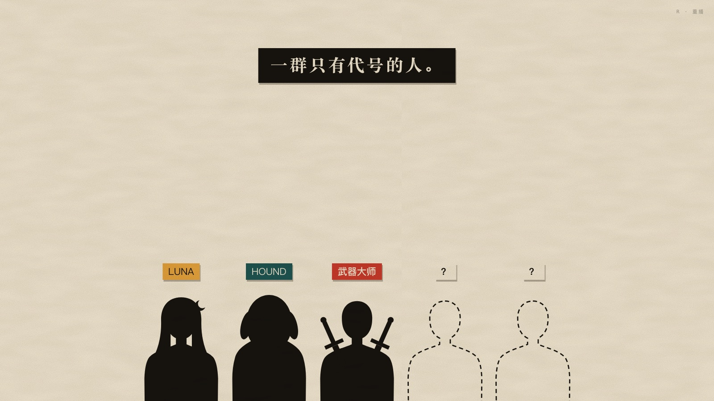
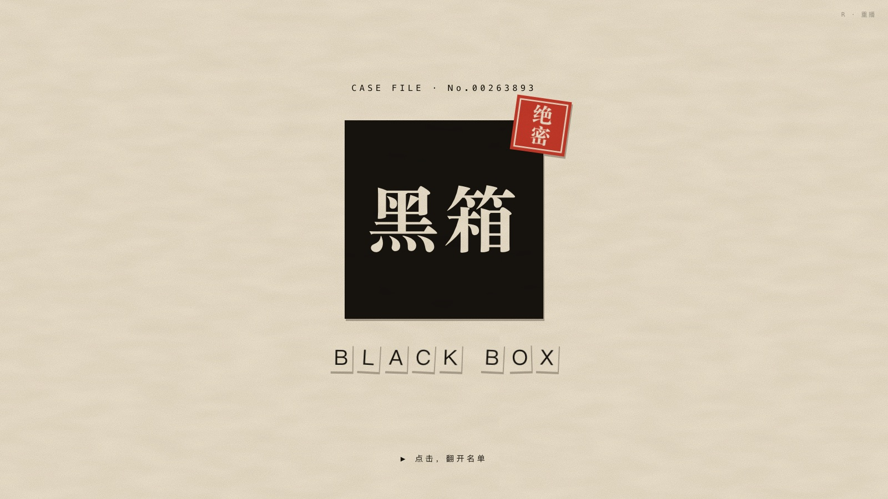
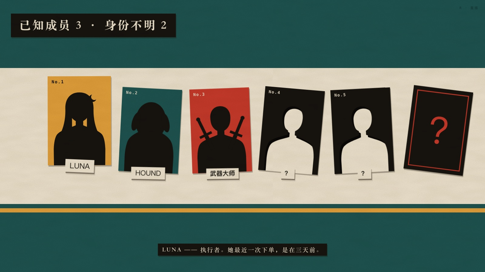
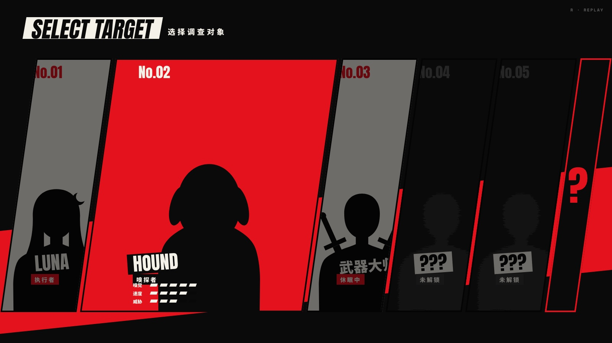

# ████

> 标题故意留白。代号 `black-box`。

一个**游戏化叙事的前端实验**。访客扮演一名侦探，骇入一个神秘组织的内部系统，顺着已知成员留下的线索一层层往下查。最后发现，所有线索都指向同一个没有名字的人，而访客一路上看到的一切，都是那个人想让他看到的。

这个构思最初是给一个已经停用的 AI 交易项目做的前端。现在它只作为一个视觉叙事实验，跟任何真实系统都没有连接。

**当前状态：** 第一轮概念验证已完成，一共做了三个方向的切片，其中 **B（黑色电影）胜出**。项目暂停中。故事设定、设计原则、第一轮反馈和后续灵感都记在 [`docs/NOTES.md`](docs/NOTES.md) 里。

---

## 三个方向

三个切片讲的是同一个故事、同一群成员，只是讲法不同。每一版都包含"开场 → 标题 → 点击 → 成员页（鼠标悬停互动）"。

### B · 黑色电影 ✦ 第一轮胜出

胶片颗粒、黑暗里的门缝光、被红线划掉的「他」。百叶窗的光扫过标题，最后进入警局的嫌疑人列队。

**列队里有五个人，墙上却有六个影子。** 鼠标移到第六个影子上，它会闪开；等视线移走，它又慢慢回来。

| | |
|---|---|
|  |  |
|  |  |

### A · 剪纸片头

参考索尔·巴斯（Saul Bass）和《猫鼠游戏》片头的思路：纸张纹理，每秒 9 帧的逐帧抖动（boil），场景之间硬切，最后盖一个「绝密」印章。未知成员被做成卡片上剪掉的一个人形洞。

| | |
|---|---|
|  |  |
|  |  |

### C · 预告函

勒索信拼贴字、放射线背景、屏幕震动。幕后之人给侦探寄来一张预告函，接着进入格斗游戏式的「SELECT TARGET」选择界面，最右边那一格永远 ACCESS DENIED。

| | |
|---|---|
|  |  |
|  | |

---

## 运行

纯静态页面，不需要构建。

```bash
python3 -m http.server 3200
```

然后打开 <http://localhost:3200>，建议全屏观看。

- 点击任意处可以跳过开场，按 `R` 重播
- 标题出现后，点击进入成员页，然后把鼠标慢慢移过每一个成员
- 在网址后加 `?shot=名称` 可以定格到某一帧，README 里的截图就是这样生成的：
  - B：`line` `him` `sweep` `title` `hover`
  - A：`lever` `coins` `members` `him` `title` `list`
  - C：`line` `him` `title` `select`

截图命令（macOS + Chrome）：

```bash
"/Applications/Google Chrome.app/Contents/MacOS/Google Chrome" --headless=new --hide-scrollbars \
  --window-size=1600,900 --virtual-time-budget=15000 \
  --screenshot=out.png "http://localhost:3200/b-noir.html?shot=hover"
```

---

## 怎么做的

**全部用代码画出来，没有一张图片素材。** 每个页面大约三四百行 HTML、CSS 和 JS，动画编排用 [GSAP](https://gsap.com/)。

| 效果 | 做法 |
|---|---|
| 人物剪影 | 手写的 SVG 贝塞尔曲线（`shared/figures.js`）。Luna 的新月发饰是两个圆相减得到的，交点坐标是算出来的 |
| 百叶窗的光 | CSS 条纹渐变 + 柔边遮罩 + `mix-blend-mode: color-dodge`。颜色减淡模式会让"越亮的东西越亮"，所以光扫过时，文字比墙亮得多 |
| 胶片颗粒 | 一块 canvas 每 42ms 重新撒一次随机噪点（约等于每秒 24 帧） |
| 未知成员的虚影 | SVG 滤镜 `feTurbulence` + `feDisplacementMap`，每秒换 9 次噪声种子 |
| 第六个影子 | 灯是"坏的"，只会偶尔闪一下，影子却一直都在。悬停时影子滑走并淡出，离开 1.6 秒后再慢慢回来 |
| 剪纸质感 | SVG 噪声纸纹（`multiply` 混合）+ 无模糊的偏移投影 + 用 CSS 的独立 `translate` / `rotate` 属性做逐帧抖动，不跟 GSAP 的 `transform` 冲突 |
| 定格动画 | GSAP 的 `steps(n)` 缓动 |
| 勒索信拼贴 | 每个字随机套一种"杂志剪报"样式（不同字体、底色、旋转），相邻两个字不重复 |
| 屏幕震动 | 对整个舞台做 `elastic.out` 回弹 |

## 文件

```
index.html            三个方向的目录页
b-noir.html           B · 黑色电影
a-cutpaper.html       A · 剪纸片头
c-calling-card.html   C · 预告函
shared/figures.js     成员剪影（Luna、Hound、武器大师、未知成员）
docs/NOTES.md         故事设定、设计原则、第一轮反馈、后续灵感
docs/shots/           截图
```

字体来自 Google Fonts（Noto Serif SC / Noto Sans SC / Special Elite / Anton 等），GSAP 来自 jsDelivr。
